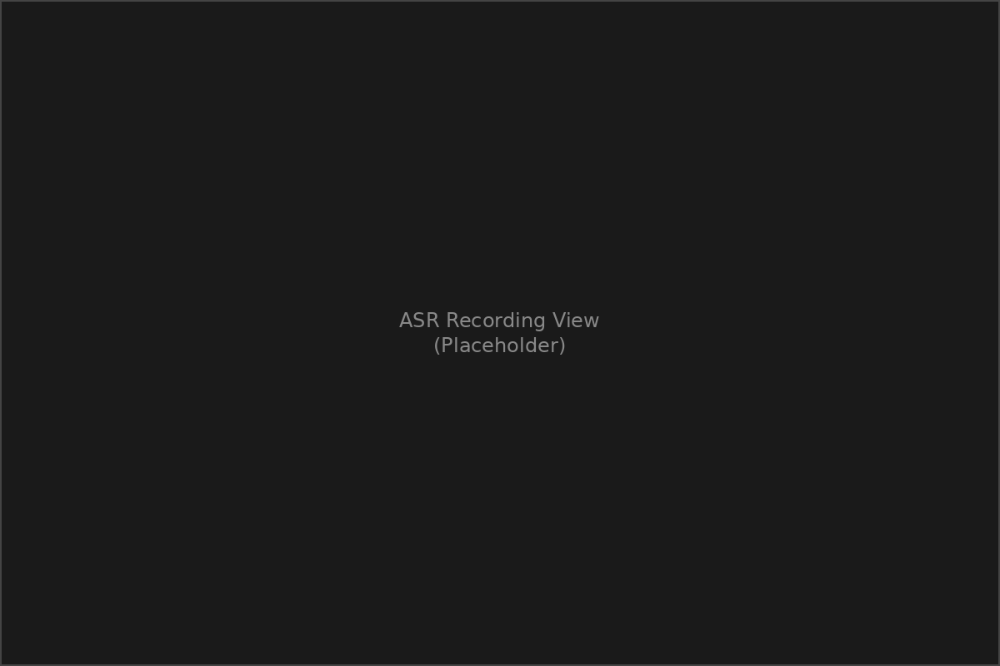
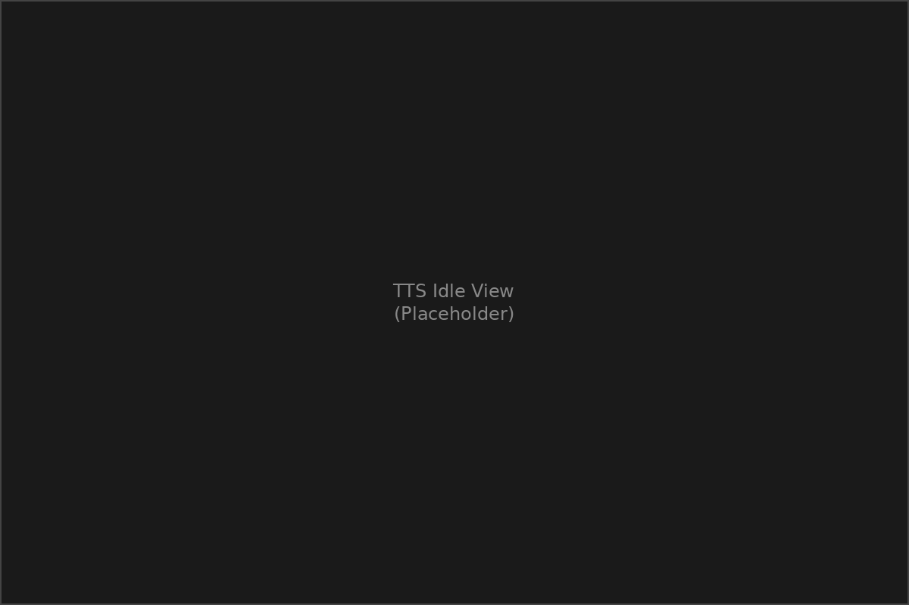

# Yap

```
        /\  __  /\
       /  \/  \/  \
      |   (o)(o)   |
       \    __    /
        \  /__\  /
         --------
```

**Local speech tools**

Local LAN web tools for speech-to-text (ASR) and text-to-speech (TTS).

---

## Overview

Yap provides a unified web application combining ASR (speech-to-text) and TTS (text-to-speech) in a single tabbed interface served from one domain.

| Feature | Description | Backend |
|---------|-------------|---------|
| **ASR** | Record audio and transcribe to text | OpenAI Whisper |
| **TTS** | Convert text to natural speech | Piper TTS |

The application runs as Docker containers with a terminal-style dark UI, designed for private LAN use.

## Architecture

Yap uses a **single-domain architecture** where:
- UI is served at `https://APP_DOMAIN/`
- ASR API is routed at `https://APP_DOMAIN/asr/*`
- TTS API is routed at `https://APP_DOMAIN/tts/*`

This is achieved via Caddy labels (production) or nginx proxy (local mode).

## Features

### ASR Tab
- Browser-based multi-clip audio recording
- Live waveform visualization with recording timer
- Whisper-powered transcription with per-clip status
- Flexible transcript copy modes (clean or with separators)
- Per-clip copy/download buttons
- Configurable transcript settings (spacing, cleanup)
- Keyboard shortcut: Space to start/stop recording

### TTS Tab
- Text input or file upload
- Multiple voice selection with preference persistence
- Adjustable speaking rate
- Audio playback with Media Session API support
- Download generated audio
- Keyboard shortcut: Ctrl+Enter to synthesize

### Apps (YAP Apps)
- Non-modal draggable/resizable app windows
- **Built-in Apps**:
  - **Ollama Summarize**: Summarize transcripts using local LLM (see [apps documentation](add-ons/README.md))
  - **Send (Webhook)**: Send transcript or conversation data to webhooks (n8n, Make, custom endpoints)
- **External Apps**: Load additional apps from a manifest URL (iframe-based, postMessage bridge)
- Extensible architecture for custom apps

## Screenshots

*(See `/docs/images/` for screenshot placeholders)*

| ASR | TTS |
|-----|-----|
|  |  |

## Quick Start

Yap supports **two run modes**:
1. **Production mode** (recommended): Uses Caddy reverse proxy with automatic HTTPS
2. **Local mode**: Direct port access for testing without Caddy

### Prerequisites

- Docker with Compose V2
- NVIDIA GPU with CUDA drivers (for ASR)
- For production mode: [caddy-docker-proxy](https://github.com/lucaslorentz/caddy-docker-proxy)

### Setup

#### 1. Clone the Repository

```bash
git clone https://github.com/itscooleric/quick-yap.git
cd quick-yap
```

#### 2. Configure Environment

```bash
cp app/.env.example app/.env
# Edit app/.env with your settings
```

Key variables:

```bash
# Single domain for unified UI
APP_DOMAIN=app.localhost

# Network
CADDY_NETWORK=caddy

# Model paths
WHISPER_MODELS_PATH=/srv/whisper-asr/models
PIPER_MODELS_PATH=/srv/piper/models

# ASR settings
ASR_ENGINE=faster_whisper
ASR_MODEL=tiny.en
```

#### 3. Create Model Directories

```bash
sudo mkdir -p /srv/whisper-asr/models
sudo mkdir -p /srv/piper/models
```

#### 4. Download TTS Voice Models

The TTS service requires voice models to work. Download at least one:

```bash
cd /srv/piper/models

# Recommended: British English Cori (high quality)
wget https://huggingface.co/rhasspy/piper-voices/resolve/v1.0.0/en/en_GB/cori/high/en_GB-cori-high.onnx
wget https://huggingface.co/rhasspy/piper-voices/resolve/v1.0.0/en/en_GB/cori/high/en_GB-cori-high.onnx.json

# Set permissions
sudo chmod 644 *.onnx *.json
```

Or use the Makefile helper:

```bash
make tts-model-cori  # Shows download commands
```

**Note**: TTS will start even without models, but will show a clear warning message. See [Troubleshooting](#troubleshooting) for details.

#### 5. Start Services

**Production Mode (with Caddy):**

```bash
# Create Caddy network (if not exists)
docker network create caddy

# Start the unified app
cd app && docker compose up -d
```

Or use the Makefile:

```bash
make app-up
```

Access at: `https://app.localhost` (or your configured `APP_DOMAIN`)

**Local Mode (without Caddy):**

```bash
cd app
docker compose -f docker-compose.yml -f docker-compose.local.yml up -d
```

Or use the Makefile:

```bash
make app-local
```

Access at: `http://localhost:8080`

Direct backend ports (for debugging):
- ASR API: `http://localhost:9000`
- TTS API: `http://localhost:5000`

### Legacy Separate Deployments

The original separate ASR and TTS deployments are still available in `asr/` and `tts/` folders. See those folders for standalone deployment instructions.

## Configuration

### Environment Variables

| Variable | Description | Default |
|----------|-------------|---------|
| `APP_DOMAIN` | Single domain for unified UI | `app.localhost` |
| `CADDY_NETWORK` | Docker network for Caddy | `caddy` |
| `WHISPER_MODELS_PATH` | Host path for Whisper models | `/srv/whisper-asr/models` |
| `PIPER_MODELS_PATH` | Host path for Piper voices | `/srv/piper/models` |
| `ASR_MODEL` | Whisper model size | `tiny.en` |
| `ASR_ENGINE` | ASR engine | `faster_whisper` |
| `ASR_DEVICE` | Compute device | `cuda` |

For legacy separate deployments:
| `ASR_DOMAIN` | ASR domain (legacy mode) | `asr.localhost` |
| `TTS_DOMAIN` | TTS domain (legacy mode) | `tts.localhost` |

### Whisper Model Sizes

| Model | Parameters | VRAM | Speed | Quality |
|-------|------------|------|-------|---------|
| tiny | 39M | ~1GB | Fastest | Low |
| base | 74M | ~1GB | Fast | Good |
| small | 244M | ~2GB | Moderate | Better |
| medium | 769M | ~5GB | Slow | High |
| large-v2/v3 | 1550M | ~10GB | Slowest | Highest |

## Repository Structure

```
yap/
├── app/                       # Unified Application (recommended)
│   ├── docker-compose.yml     # Production config with Caddy labels
│   ├── docker-compose.local.yml # Local development override
│   ├── .env.example           # Environment template
│   ├── README.md              # Unified app documentation
│   └── ui/                    # Static web UI
│       ├── index.html         # Main HTML with tabs
│       ├── favicon.svg        # Yak logo
│       ├── config.js          # Optional config
│       ├── nginx.conf         # Nginx config for local mode
│       ├── css/styles.css     # Shared styles
│       └── js/                # ES modules
│           ├── main.js        # Tab router + bootstrap
│           ├── asr.js         # ASR tab logic
│           ├── tts.js         # TTS tab logic
│           ├── addons.js      # Apps window manager
│           └── util.js        # Utility functions
├── asr/                       # Legacy Speech-to-Text (standalone)
│   ├── docker-compose.yml
│   ├── docker-compose.local.yml
│   ├── .env.example
│   ├── README.md
│   └── ui/
├── tts/                       # Text-to-Speech Backend + Legacy UI
│   ├── docker-compose.yml
│   ├── docker-compose.local.yml
│   ├── Dockerfile
│   ├── app.py
│   ├── .env.example
│   ├── README.md
│   └── ui/
├── add-ons/                   # Apps documentation and examples
│   ├── README.md              # Apps guide
│   └── ollama-summarize/      # Ollama integration docs
├── tests/                     # Automated tests
│   ├── test_tts.py            # TTS endpoint tests
│   └── requirements.txt       # Test dependencies
├── docs/
│   └── images/
├── .env.example               # Root configuration template
├── .gitignore
├── LICENSE
├── Makefile                   # Helper commands
└── README.md
```

## Apps (YAP Apps)

Yap includes an extensible apps system for additional functionality. See the [apps documentation](add-ons/README.md) for details on:

- Using built-in apps (Ollama Summarize, Send/Webhook)
- Loading external apps from a manifest URL
- Creating custom apps
- Apps API reference

### Apps Configuration

Configure apps in `app/ui/config.js`:

```javascript
window.__YAP_CONFIG = {
  // External apps manifest URL (optional)
  appsManifestUrl: 'https://example.com/yap-apps/manifest.json',
  
  // Allowed origins for iframe apps (REQUIRED for external apps)
  appsAllowedOrigins: ['https://apps.example.com'],
  
  // Ollama configuration
  ollamaUrl: 'http://localhost:11434',
  ollamaModel: 'llama3'
};
```

### External Apps Manifest

External apps are loaded from a JSON manifest:

```json
{
  "version": 1,
  "apps": [
    {
      "id": "my-app",
      "name": "My App",
      "description": "Description of my app",
      "type": "iframe",
      "entryUrl": "https://apps.example.com/my-app/index.html"
    }
  ]
}
```

## Testing

Automated tests are available in the `tests/` directory:

```bash
# Install test dependencies
pip install -r tests/requirements.txt

# Run TTS tests (requires TTS service running)
pytest tests/test_tts.py -v
```

See [tests/README.md](tests/README.md) for more details on running tests.

## Makefile Helpers

Common commands for managing Yap services:

```bash
make help           # Show all available commands

# Unified App (recommended)
make app-up         # Start unified app (Caddy mode)
make app-local      # Start unified app (local mode)
make app-down       # Stop unified app
make app-logs       # View app logs
make app-restart    # Restart app

# Legacy ASR (standalone)
make asr-up         # Start ASR services
make asr-down       # Stop ASR services
make asr-logs       # View ASR logs
make asr-restart    # Restart ASR

# Legacy TTS (standalone)
make tts-up         # Start TTS services
make tts-down       # Stop TTS services
make tts-logs       # View TTS logs
make tts-restart    # Restart TTS
make tts-health     # Check TTS health endpoint
make tts-voices     # List available voices
make tts-model-cori # Show commands to download Cori voice
```

## Security Notes

> **Warning**: These tools are designed for private LAN use and have **no authentication** by default.

### Recommendations

1. **Do not expose to the public internet** without authentication
2. If you must expose publicly, add authentication via Caddy:

```caddyfile
asr.yourdomain.com {
    basicauth /* {
        user $2a$14$hashedpassword
    }
    # ... rest of config
}
```

3. Use HTTPS (automatic with Caddy)
4. Consider VPN access for remote use

### What is exposed

- ASR: Audio recordings are sent to your server for transcription
- TTS: Text is sent to your server for synthesis
- No data is sent to external services (all processing is local)

## Troubleshooting

### TTS Issues

**No voices available / TTS won't synthesize**

The TTS backend will start successfully even without voice models, but it will display a prominent warning in the logs. To fix:

1. Check the TTS logs:
   ```bash
   make tts-logs
   # or
   cd tts && docker compose logs -f
   ```

2. If you see "NO VOICES FOUND" warning, download voice models:
   ```bash
   make tts-model-cori  # Shows commands to download
   ```

3. Verify the models are in the correct directory:
   ```bash
   ls -la $PIPER_MODELS_PATH
   # Should show .onnx and .onnx.json files
   ```

4. Test API endpoints (Caddy mode):
   ```bash
   # Check health endpoint
   curl -k https://$APP_DOMAIN/tts/health
   # Should return: {"status":"ok","voices_count":1}
   
   # List available voices
   curl -k https://$APP_DOMAIN/tts/voices
   # Should return: ["en_GB-cori-high"]
   
   # Test synthesis (POST method)
   curl -k https://$APP_DOMAIN/tts/synthesize/en_GB-cori-high \
     -X POST \
     -H "Content-Type: text/plain" \
     -d "Hello world" \
     --output test.wav
   # Should create test.wav file
   ```

5. Test API endpoints (Local mode):
   ```bash
   curl http://localhost:8080/tts/health
   curl http://localhost:8080/tts/voices
   
   # Test synthesis
   curl http://localhost:8080/tts/synthesize/en_GB-cori-high \
     -X POST \
     -H "Content-Type: text/plain" \
     -d "Hello world" \
     --output test.wav
   
   # Or test directly on TTS service port (bypassing nginx)
   curl http://localhost:5000/health
   curl http://localhost:5000/voices
   ```

**TTS synthesis returns 405 Method Not Allowed**

If you receive a 405 error when trying to synthesize:

1. Verify the endpoint accepts POST requests:
   ```bash
   # Should work with POST (recommended)
   curl -X POST http://localhost:5000/synthesize/VOICE_NAME \
     -H "Content-Type: text/plain" \
     -d "Test text"
   
   # Also works with GET
   curl "http://localhost:5000/synthesize/VOICE_NAME?text=Test+text"
   ```

2. Check NGINX/Caddy logs for routing issues:
   ```bash
   docker compose logs yap-app-ui
   ```

3. Ensure no redirects are happening (redirects can change POST to GET):
   - Check for trailing slash issues in URLs
   - Verify proxy configuration preserves HTTP method

**Voice files present but not detected**

Each voice model requires BOTH files to work:
- `.onnx` - The neural network model file
- `.onnx.json` - The model configuration file

If voices are empty or not detected:
- Ensure both `.onnx` AND `.onnx.json` files exist for each voice
- Check file permissions: `sudo chmod 644 *.onnx *.json`
- Verify the `PIPER_MODELS_PATH` environment variable matches your directory
- Restart the TTS service: `make tts-restart`

**Synthesis slow**
- Use medium quality voices instead of high for faster synthesis
- Longer texts take more time to process

### ASR Issues

**GPU not detected**
```bash
# Verify NVIDIA Container Toolkit
nvidia-smi
docker run --rm --gpus all nvidia/cuda:11.0-base nvidia-smi
```

If GPU isn't detected, ensure:
- NVIDIA drivers are installed
- NVIDIA Container Toolkit is installed
- Docker has been restarted after toolkit installation

**Microphone not working**
- Check browser permissions
- Ensure HTTPS or localhost (required for `getUserMedia`)
- Check browser console for errors

**Model download slow**
- First startup downloads the Whisper model
- Models are cached in `$WHISPER_MODELS_PATH` for subsequent runs
- Larger models (medium, large) take longer to download

### General Issues

**Container won't start**
```bash
# Check logs
docker compose logs -f

# Check container status
docker ps -a
```

**Network issues (Caddy mode)**
```bash
# Verify Caddy network exists
docker network inspect caddy

# If network doesn't exist, create it
docker network create caddy
```

**Environment variables not being used**
- Ensure `.env` file exists in the appropriate directory (root, asr/, or tts/)
- Check for typos in variable names
- Restart containers after changing `.env`: `make tts-restart` or `make asr-restart`

## Contributing

1. Fork the repository
2. Create a feature branch
3. Make your changes
4. Submit a pull request

## License

MIT - See [LICENSE](LICENSE)

---

*YAP - Local speech tools*
